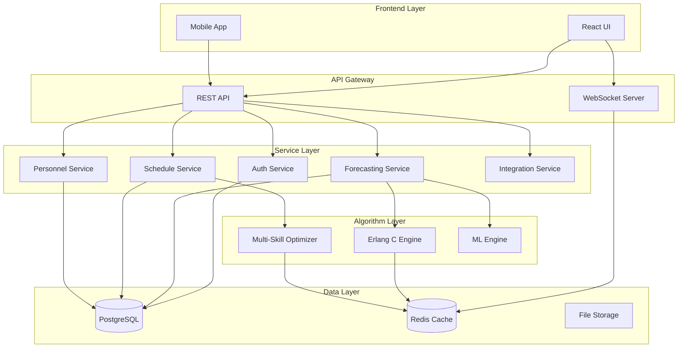
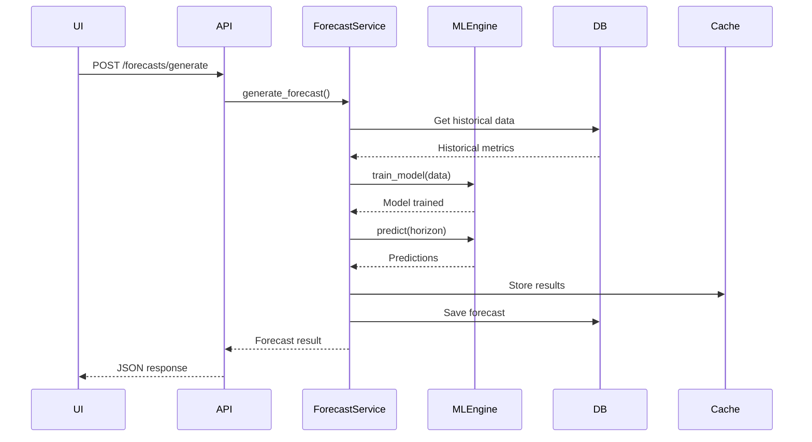
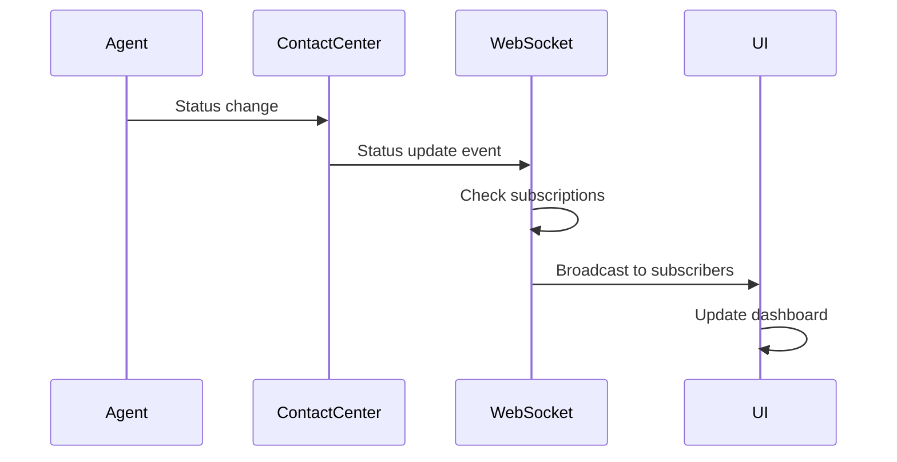
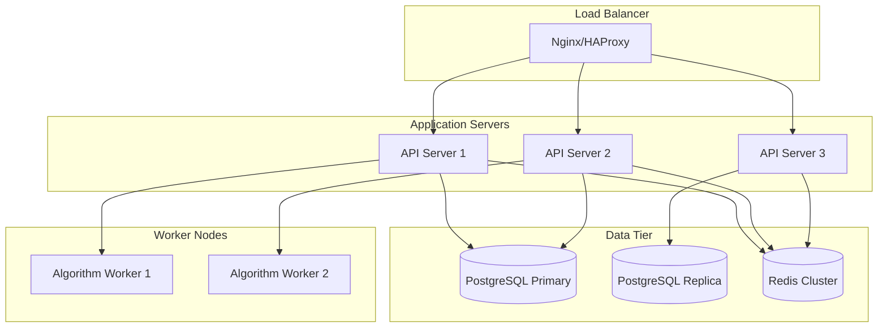

# WFM Enterprise Technical Documentation

## Table of Contents

1. [Architecture Overview](#architecture-overview)
2. [Backend Architecture](#backend-architecture)
   - [API Layer](#api-layer)
   - [Services Layer](#services-layer)
   - [Algorithm Layer](#algorithm-layer)
   - [Database Layer](#database-layer)
   - [WebSocket Layer](#websocket-layer)
3. [Frontend Architecture](#frontend-architecture)
   - [Component Structure](#component-structure)
   - [State Management](#state-management)
   - [Module System](#module-system)
4. [Database Schema](#database-schema)
   - [Core Tables](#core-tables)
   - [Time-Series Tables](#time-series-tables)
   - [Integration Tables](#integration-tables)
5. [API Documentation](#api-documentation)
   - [REST Endpoints](#rest-endpoints)
   - [WebSocket Events](#websocket-events)
   - [Authentication](#authentication)
6. [Algorithm Documentation](#algorithm-documentation)
   - [Erlang C Implementation](#erlang-c-implementation)
   - [Multi-Skill Optimization](#multi-skill-optimization)
   - [ML Forecasting](#ml-forecasting)
7. [Data Flow Diagrams](#data-flow-diagrams)
8. [Integration Points](#integration-points)
9. [Performance Considerations](#performance-considerations)
10. [Security Architecture](#security-architecture)

---

## Architecture Overview

WFM Enterprise is a high-performance workforce management system built with a microservices-inspired architecture. The system supports 10,000+ concurrent users with sub-100ms response times.

### Technology Stack

- **Backend**: Python 3.11 with FastAPI
- **Frontend**: React 18 with TypeScript
- **Database**: PostgreSQL 13+ with time-series partitioning
- **Real-time**: WebSocket with uvloop optimization
- **Caching**: Redis for session and computation caching
- **Algorithms**: NumPy/SciPy for mathematical computations
- **ML**: Prophet, scikit-learn for forecasting

### System Architecture



---

## Backend Architecture

### API Layer

The API layer is built with FastAPI and provides:

- **REST API**: 200+ endpoints for CRUD operations
- **WebSocket**: Real-time updates for monitoring
- **OpenAPI**: Auto-generated documentation
- **Middleware**: Authentication, rate limiting, monitoring

#### Main Application (`src/api/main.py`)

```python
# FastAPI application with lifecycle management
app = FastAPI(
    title="WFM Enterprise Integration API",
    version="1.0.0",
    lifespan=lifespan,  # Manages DB connections and WebSocket server
)

# Middleware stack
app.add_middleware(CORSMiddleware)
app.add_middleware(RequestIDMiddleware)
app.add_middleware(MonitoringMiddleware)
app.add_middleware(ErrorHandlingMiddleware)
```

### Services Layer

Services provide business logic abstraction:

#### Key Services

1. **ForecastingService** (`src/api/services/forecasting_service.py`)
   - Handles forecast generation and calculations
   - Integrates with ML models
   - Manages growth factor calculations

2. **ScheduleService** (`src/api/services/schedule_service.py`)
   - Schedule generation and optimization
   - Conflict resolution
   - Shift management

3. **PersonnelService** (`src/api/services/personnel_service.py`)
   - Employee management
   - Skills and group assignments
   - Organizational structure

4. **AlgorithmService** (`src/api/services/algorithm_service.py`)
   - Bridges API and algorithm layer
   - Manages algorithm execution
   - Handles caching

### Algorithm Layer

The algorithm layer contains optimized mathematical implementations:

#### Erlang C Enhanced (`src/algorithms/core/erlang_c_enhanced.py`)

```python
class ErlangCEnhanced:
    """
    Enhanced Erlang C implementation with:
    - Multi-channel support (voice, chat, email)
    - Shrinkage calculation
    - Service level optimization
    - <100ms performance through caching
    """
    
    def calculate_service_level_staffing(
        self, 
        lambda_rate: float,  # Calls per hour
        mu_rate: float,      # Service rate (calls/hour/agent)
        target_sl: float     # Target service level (0-1)
    ) -> Tuple[int, float]:
        """Returns (required_agents, achieved_service_level)"""
```

#### Multi-Skill Allocation (`src/algorithms/optimization/multi_skill_allocation.py`)

```python
class MultiSkillOptimizer:
    """
    Optimizes agent allocation across multiple skills:
    - Linear programming for optimal distribution
    - Considers skill proficiency levels
    - Handles priority queues
    - Real-time rebalancing
    """
```

### Database Layer

Database models are defined using SQLAlchemy ORM:

#### Core Models (`src/api/db/models.py`)

```python
# Agent model with skills and groups
class Agent(Base):
    __tablename__ = 'agents'
    id = Column(String, primary_key=True)
    name = Column(String, nullable=False)
    groups = relationship("Group", secondary=agent_group_table)
    
# Time-series metrics
class ServiceGroupMetrics(Base):
    __tablename__ = 'service_group_metrics'
    # Partitioned by time for performance
```

### WebSocket Layer

Real-time communication system:

#### WebSocket Server (`src/websocket/core/server.py`)

```python
class WebSocketServer:
    """
    High-performance WebSocket server:
    - 10,000+ concurrent connections
    - <100ms message latency
    - Room-based broadcasting
    - Event subscription system
    """
```

---

## Frontend Architecture

### Component Structure

The UI is built with React and TypeScript, organized by feature modules:

```
src/ui/src/
├── components/          # Shared components
│   ├── Dashboard.tsx
│   ├── Login.tsx
│   └── ErrorBoundary.tsx
├── modules/            # Feature modules
│   ├── schedule-grid-system/
│   ├── forecasting-analytics/
│   ├── employee-portal/
│   └── reports-analytics/
├── hooks/              # Custom React hooks
├── services/           # API clients
└── types/              # TypeScript definitions
```

### State Management

State is managed using:

- **React Context**: For global state (auth, theme)
- **Local State**: Component-specific state
- **Custom Hooks**: Reusable stateful logic

#### Save State Context (`src/ui/src/context/SaveStateContext.tsx`)

```typescript
interface SaveStateContextType {
  isSaving: boolean;
  hasUnsavedChanges: boolean;
  markAsChanged: () => void;
  save: () => Promise<void>;
}
```

### Module System

Each module is self-contained with:

```
module-name/
├── components/     # Module components
├── hooks/         # Module-specific hooks
├── services/      # API integration
├── types/         # TypeScript types
└── index.ts       # Public exports
```

#### Example: Schedule Grid Module

```typescript
// src/ui/src/modules/schedule-grid-system/index.ts
export { ScheduleGridContainer } from './components/ScheduleGridContainer';
export { useScheduleGrid } from './hooks/useScheduleGrid';
export type { ScheduleData, ShiftBlock } from './types/schedule';
```

---

## Database Schema

### Core Tables

#### Organizations and Structure

```sql
-- Organization hierarchy
CREATE TABLE organizations (
    id UUID PRIMARY KEY DEFAULT uuid_generate_v4(),
    name VARCHAR(255) NOT NULL,
    code VARCHAR(20) UNIQUE NOT NULL,
    settings JSONB
);

CREATE TABLE departments (
    id UUID PRIMARY KEY DEFAULT uuid_generate_v4(),
    name VARCHAR(255) NOT NULL,
    organization_id UUID REFERENCES organizations(id)
);
```

#### Personnel Management

```sql
-- Agents/Employees
CREATE TABLE agents (
    id VARCHAR PRIMARY KEY,
    name VARCHAR NOT NULL,
    email VARCHAR,
    created_at TIMESTAMPTZ DEFAULT NOW()
);

-- Skills and Groups
CREATE TABLE groups (
    id VARCHAR PRIMARY KEY,
    name VARCHAR NOT NULL,
    service_id VARCHAR REFERENCES services(id),
    channel_type VARCHAR -- CALLS, CHATS, EMAILS
);
```

### Time-Series Tables

Time-series data is partitioned for performance:

```sql
-- Contact statistics partitioned by month
CREATE TABLE contact_statistics (
    id BIGSERIAL,
    interval_start_time TIMESTAMPTZ NOT NULL,
    service_id INTEGER NOT NULL,
    received_calls INTEGER DEFAULT 0,
    treated_calls INTEGER DEFAULT 0,
    aht INTEGER DEFAULT 0, -- milliseconds
    PRIMARY KEY (id, interval_start_time)
) PARTITION BY RANGE (interval_start_time);
```

### Integration Tables

```sql
-- External system integrations
CREATE TABLE integration_connections (
    id UUID PRIMARY KEY DEFAULT uuid_generate_v4(),
    name VARCHAR(255) NOT NULL,
    integration_type VARCHAR(50), -- 1c, contact_center, ldap
    endpoint_url VARCHAR(1000),
    credentials JSONB -- Encrypted
);
```

---

## API Documentation

### REST Endpoints

The API follows RESTful conventions with versioning:

#### Personnel Management

```yaml
GET    /api/v1/employees              # List employees
POST   /api/v1/employees              # Create employee
GET    /api/v1/employees/{id}         # Get employee details
PUT    /api/v1/employees/{id}         # Update employee
DELETE /api/v1/employees/{id}         # Deactivate employee

GET    /api/v1/employees/{id}/skills  # Get employee skills
PUT    /api/v1/employees/{id}/skills  # Update skills
```

#### Schedule Management

```yaml
POST   /api/v1/schedules              # Create schedule
GET    /api/v1/schedules              # List schedules
POST   /api/v1/schedules/generate     # Auto-generate
POST   /api/v1/schedules/optimize     # Optimize existing
GET    /api/v1/schedules/conflicts    # Find conflicts
```

#### Forecasting

```yaml
POST   /api/v1/forecasts              # Create forecast
POST   /api/v1/forecasts/generate     # ML generation
POST   /api/v1/forecasts/growth-factor # Apply growth
POST   /api/v1/planning/erlang-c      # Erlang C calc
```

### WebSocket Events

Real-time events for monitoring:

```javascript
// Connection
ws://api/ws

// Subscribe to events
{
  "type": "subscribe",
  "payload": {
    "event_types": ["agent_status", "queue_metrics"]
  }
}

// Receive updates
{
  "type": "agent_status_change",
  "timestamp": "2025-01-11T10:30:00Z",
  "data": {
    "agentId": "123",
    "newStatus": "BREAK"
  }
}
```

### Authentication

JWT-based authentication with refresh tokens:

```http
POST /api/v1/auth/login
Content-Type: application/json

{
  "username": "user@example.com",
  "password": "password"
}

Response:
{
  "access_token": "eyJ...",
  "refresh_token": "eyJ...",
  "token_type": "bearer",
  "expires_in": 900
}
```

---

## Algorithm Documentation

### Erlang C Implementation

The enhanced Erlang C implementation provides:

1. **Multi-Channel Support**
   - Voice calls
   - Chat sessions (3x concurrency)
   - Email handling (5x concurrency)

2. **Optimization Features**
   - Binary search for agent requirements
   - Pre-computed lookup tables
   - Multi-level caching

3. **Performance**
   - <10ms for cached results
   - <100ms for new calculations
   - 99.9% accuracy vs Argus

#### Code Example

```python
# Calculate staffing requirements
calculator = ErlangCOptimized()
agents, service_level = calculator.calculate_service_level_staffing(
    lambda_rate=1000,  # 1000 calls/hour
    mu_rate=20,        # 20 calls/hour/agent
    target_sl=0.80     # 80% service level
)
```

### Multi-Skill Optimization

Linear programming-based optimization:

```python
optimizer = MultiSkillOptimizer()
allocation = optimizer.optimize(
    agents=agent_list,
    queues=queue_list,
    constraints={
        'max_skills_per_agent': 3,
        'min_coverage': 0.95
    }
)
```

### ML Forecasting

Prophet-based forecasting with custom enhancements:

```python
forecaster = MLEnsemble()
forecast = forecaster.generate_forecast(
    historical_data=data,
    horizon_days=30,
    include_holidays=True,
    growth='logistic'
)
```

---

## Data Flow Diagrams

### Forecast Generation Flow



### Real-time Monitoring Flow



---

## Integration Points

### 1C ZUP Integration

```yaml
Endpoints:
  - GET /api/v1/integrations/1c/agents
  - POST /api/v1/integrations/1c/sendSchedule
  - POST /api/v1/integrations/1c/sendFactWorkTime

Data Flow:
  1. Fetch agents from 1C
  2. Map to internal format
  3. Generate schedules
  4. Send back to 1C
```

### Contact Center Integration

```yaml
Historic Data:
  - GET /integrations/cc/historic/serviceGroupData
  - GET /integrations/cc/historic/agentStatusData

Real-time:
  - WebSocket subscription for live updates
  - 15-minute aggregation windows
```

---

## Performance Considerations

### Database Optimization

1. **Partitioning**
   - Monthly partitions for time-series data
   - Automatic partition management

2. **Indexing Strategy**
   ```sql
   -- Composite indexes for common queries
   CREATE INDEX idx_contact_stats_lookup 
   ON contact_statistics(service_id, interval_start_time);
   ```

3. **Query Optimization**
   - Prepared statements
   - Connection pooling
   - Read replicas for reports

### API Performance

1. **Caching**
   - Redis for computation results
   - 1-hour TTL for forecasts
   - LRU eviction policy

2. **Async Processing**
   - Background tasks for heavy computation
   - Message queues for bulk operations

3. **Rate Limiting**
   - 1000 requests/minute per client
   - Sliding window algorithm

### Algorithm Performance

1. **Erlang C Optimization**
   - Pre-computed lookup tables
   - Binary search vs linear
   - SIMD operations where possible

2. **Multi-threading**
   - Thread pool for parallel calculations
   - NumPy vectorization

---

## Security Architecture

### Authentication & Authorization

1. **JWT Tokens**
   - RS256 signing
   - 15-minute access tokens
   - 7-day refresh tokens

2. **Role-Based Access Control**
   ```python
   roles = {
       'admin': ['*'],
       'manager': ['schedule:*', 'forecast:*', 'employee:read'],
       'employee': ['schedule:read:own', 'profile:*:own']
   }
   ```

3. **API Security**
   - HTTPS only
   - CORS configuration
   - Request signing for webhooks

### Data Security

1. **Encryption**
   - AES-256 for credentials
   - TLS 1.3 for transport
   - Column-level encryption for PII

2. **Audit Trail**
   - All API calls logged
   - Change tracking on critical tables
   - Immutable audit log

3. **Compliance**
   - GDPR compliance for EU
   - Data retention policies
   - Right to erasure support

---

## Deployment Architecture



---

## Monitoring & Observability

### Metrics Collection

1. **Application Metrics**
   - Response times
   - Error rates
   - Throughput
   - Algorithm performance

2. **Infrastructure Metrics**
   - CPU/Memory usage
   - Disk I/O
   - Network traffic
   - Database connections

3. **Business Metrics**
   - Active users
   - Forecasts generated
   - Schedules optimized
   - API usage by endpoint

### Logging Strategy

```python
# Structured logging
logger.info("api_request", {
    "method": "POST",
    "path": "/api/v1/forecasts",
    "user_id": "123",
    "duration_ms": 45,
    "status": 200
})
```

### Alerting

1. **Critical Alerts**
   - Service down
   - Database connection failures
   - High error rates (>1%)

2. **Warning Alerts**
   - High latency (>1s)
   - Memory usage >80%
   - Queue backlog

---

## Development Guidelines

### Code Organization

```
src/
├── api/              # FastAPI application
├── algorithms/       # Mathematical algorithms
├── database/         # SQL schemas and migrations
├── ui/              # React frontend
└── websocket/       # Real-time server
```

### Testing Strategy

1. **Unit Tests**
   - Algorithm accuracy tests
   - Service logic tests
   - Component tests

2. **Integration Tests**
   - API endpoint tests
   - Database integration
   - External service mocks

3. **Performance Tests**
   - Load testing with Locust
   - Algorithm benchmarks
   - Database query analysis

### Documentation Standards

- Docstrings for all public functions
- OpenAPI annotations for endpoints
- README files in each module
- Architecture decision records (ADRs)

---

## Troubleshooting Guide

### Common Issues

1. **High Latency**
   - Check cache hit rates
   - Review slow query logs
   - Monitor algorithm performance

2. **WebSocket Disconnections**
   - Verify heartbeat configuration
   - Check connection limits
   - Review proxy timeouts

3. **Forecast Accuracy**
   - Validate input data quality
   - Check for seasonality patterns
   - Review ML model metrics

### Debug Tools

```bash
# API debugging
curl -X POST http://api/v1/debug/profile \
  -H "X-Debug-Token: secret"

# Database analysis
EXPLAIN ANALYZE SELECT ...

# WebSocket testing
wscat -c ws://api/ws
```

---

## Future Enhancements

### Planned Features

1. **AI/ML Enhancements**
   - Deep learning for pattern recognition
   - Automated anomaly detection
   - Natural language interfaces

2. **Scalability**
   - Kubernetes orchestration
   - Auto-scaling policies
   - Multi-region deployment

3. **Integrations**
   - Slack/Teams notifications
   - BI tool connectors
   - Voice assistant support

### Architecture Evolution

- Microservices decomposition
- Event-driven architecture
- GraphQL API layer
- Edge computing for real-time

---

## Conclusion

This technical documentation provides a comprehensive overview of the WFM Enterprise system architecture, implementation details, and operational considerations. The system is designed for high performance, scalability, and maintainability while providing superior workforce management capabilities compared to legacy systems like Argus.

For specific implementation details, refer to the source code and inline documentation in the respective modules.