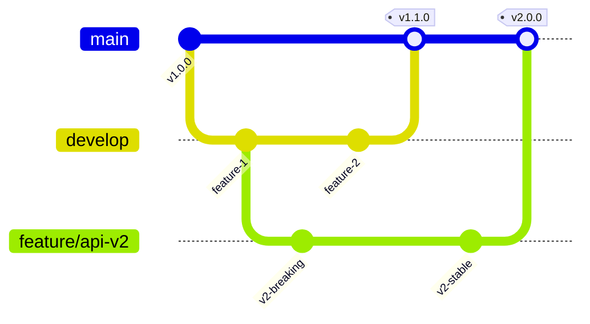

# API Versioning Strategy
## WFM Enterprise API Lifecycle Management

### Version: 1.0
### Date: January 2025
### Status: Active

---

## Executive Summary

This document defines the versioning strategy for WFM Enterprise APIs to ensure backward compatibility, smooth migrations, and clear communication with API consumers while maintaining agility for innovation.

---

## Versioning Principles

### 1. **Semantic Versioning**
We follow semantic versioning (SemVer) for all APIs:
- **MAJOR.MINOR.PATCH** (e.g., 1.2.3)
- **MAJOR**: Breaking changes
- **MINOR**: New features (backward compatible)
- **PATCH**: Bug fixes (backward compatible)

### 2. **URL-Based Versioning**
Version numbers appear in the URL path:
```
https://api.wfm-enterprise.com/api/v1/employees
https://api.wfm-enterprise.com/api/v2/employees
```

### 3. **Backward Compatibility**
- Breaking changes require new major version
- Minimum 6-month deprecation notice
- 12-month support after new version stable

---

## Git Branching Strategy

### Branch Structure
```
main                    # Current stable API (v1)
├── develop            # Next minor release (v1.x)
├── feature/api-v2     # Next major version development
├── feature/*          # Feature branches
├── release/v1.x       # Release candidates
└── hotfix/v1.x        # Production fixes
```

### Git Flow


### Tagging Convention
```bash
# Release tags
api-v1.0.0              # Major release
api-v1.1.0              # Minor release
api-v1.1.1              # Patch release

# Pre-release tags
api-v2.0.0-alpha.1      # Alpha version
api-v2.0.0-beta.1       # Beta version
api-v2.0.0-rc.1         # Release candidate
```

---

## Version Lifecycle

### 1. **Development Phase**
- Version: `v0` or `vNext`
- Stability: Experimental
- Breaking changes: Allowed
- Documentation: Basic
- Access: Limited/invite-only

### 2. **Beta Phase**
- Version: `v2-beta`
- Stability: Testing
- Breaking changes: With notice
- Documentation: Complete
- Access: Public with warning

### 3. **Stable Phase**
- Version: `v2`
- Stability: Production
- Breaking changes: Not allowed
- Documentation: Comprehensive
- Access: General availability

### 4. **Deprecated Phase**
- Version: `v1` (when v2 stable)
- Stability: Maintenance only
- Breaking changes: Never
- Documentation: Migration guide
- Access: Existing users only

### 5. **Sunset Phase**
- Version: `v1` (12 months after v2)
- Stability: End of life
- Breaking changes: N/A
- Documentation: Archived
- Access: Discontinued

---

## API Version Headers

### Request Headers
```http
# Client can request specific version
X-API-Version: 1.0
Accept: application/vnd.wfm.v1+json
```

### Response Headers
```http
# Server indicates version info
X-API-Version: 1.0
X-API-Deprecated: false
X-API-Sunset-Date: 2026-01-01
X-API-Migration-Guide: https://docs.wfm.com/migrate/v1-v2
X-API-Version-Latest: 2.0
```

---

## Breaking Change Definition

### What Constitutes a Breaking Change:
1. **Removing endpoints**
2. **Removing fields from responses**
3. **Changing field types**
4. **Changing required fields**
5. **Changing authentication methods**
6. **Changing error response formats**
7. **Changing rate limits (more restrictive)**

### What Is NOT a Breaking Change:
1. **Adding new endpoints**
2. **Adding optional fields to responses**
3. **Adding optional parameters**
4. **Adding new error codes**
5. **Performance improvements**
6. **Bug fixes**
7. **Documentation updates**

---

## Version Migration Strategy

### 1. **Deprecation Notice**
```json
{
  "data": {...},
  "_metadata": {
    "deprecation": {
      "message": "This endpoint is deprecated",
      "sunset_date": "2026-01-01",
      "migration_guide": "https://docs.wfm.com/migrate",
      "replacement": "/api/v2/employees"
    }
  }
}
```

### 2. **Parallel Running**
```nginx
# Route based on header
location /api/employees {
    if ($http_x_api_version = "2.0") {
        proxy_pass http://api-v2;
    }
    proxy_pass http://api-v1;  # Default to v1
}
```

### 3. **Feature Flags**
```python
@feature_flag("v2_employee_api")
def get_employee(employee_id):
    if feature_enabled("v2_employee_api"):
        return v2_employee_logic(employee_id)
    return v1_employee_logic(employee_id)
```

---

## Client Migration Path

### Step 1: Announcement (T-6 months)
- Email notification to all API consumers
- Banner in API documentation
- Deprecation headers in responses

### Step 2: Beta Access (T-3 months)
- v2 available in beta
- Migration guide published
- Support channels open

### Step 3: General Availability (T=0)
- v2 becomes recommended version
- v1 marked as deprecated
- Automated migration tools available

### Step 4: Sunset Warning (T+9 months)
- Final migration reminders
- Usage analytics shared
- Migration assistance offered

### Step 5: Sunset (T+12 months)
- v1 endpoints return 410 Gone
- Redirects to migration guide
- Support for stragglers

---

## Implementation Guidelines

### 1. **Code Organization**
```
src/api/
├── v1/
│   ├── endpoints/
│   ├── schemas/
│   └── tests/
├── v2/
│   ├── endpoints/
│   ├── schemas/
│   └── tests/
└── common/
    ├── auth/
    ├── middleware/
    └── utils/
```

### 2. **URL Routing**
```python
# FastAPI example
from fastapi import APIRouter

# Version 1 routes
v1_router = APIRouter(prefix="/api/v1")
v1_router.include_router(employees_v1.router)

# Version 2 routes
v2_router = APIRouter(prefix="/api/v2")
v2_router.include_router(employees_v2.router)

app.include_router(v1_router)
app.include_router(v2_router)
```

### 3. **Schema Evolution**
```python
# v1 schema
class EmployeeV1(BaseModel):
    id: int
    name: str
    email: str

# v2 schema (breaking change: split name)
class EmployeeV2(BaseModel):
    id: int
    first_name: str  # Breaking: was 'name'
    last_name: str   # Breaking: new required field
    email: str
    phone: Optional[str]  # Non-breaking: new optional
```

---

## Documentation Strategy

### 1. **Version-Specific Docs**
```
docs.wfm-enterprise.com/api/v1/
docs.wfm-enterprise.com/api/v2/
docs.wfm-enterprise.com/api/latest/  # Redirects to v2
```

### 2. **Migration Guides**
Each major version includes:
- What's new
- Breaking changes
- Migration checklist
- Code examples
- Common pitfalls

### 3. **API Changelog**
```markdown
# API Changelog

## v2.0.0 (2025-01-15)
### Breaking Changes
- Split `name` field into `first_name` and `last_name`
- Removed deprecated `/api/v1/legacy` endpoints

### New Features
- Added WebSocket support
- Added bulk operations
- Added field-level permissions

### Improvements
- 50% faster response times
- Better error messages
```

---

## Monitoring & Analytics

### Version Usage Tracking
```sql
-- Track API version usage
SELECT 
    api_version,
    COUNT(*) as request_count,
    COUNT(DISTINCT client_id) as unique_clients
FROM api_requests
WHERE timestamp > NOW() - INTERVAL '24 hours'
GROUP BY api_version;
```

### Deprecation Monitoring
- Track clients still using deprecated versions
- Alert on high deprecated API usage
- Generate migration status reports

### Client Communication
```python
# Automated deprecation notices
for client in get_deprecated_api_users():
    send_email(
        to=client.email,
        subject="API v1 Deprecation Notice",
        template="deprecation_reminder",
        data={
            "sunset_date": "2026-01-01",
            "usage_stats": get_client_usage(client),
            "migration_guide": "https://docs.wfm.com/migrate"
        }
    )
```

---

## Special Considerations

### 1. **Mobile Apps**
- Longer deprecation period (18 months)
- Force-update mechanisms
- Graceful degradation

### 2. **Webhooks**
- Version webhooks separately
- Maintain compatibility longer
- Clear retry policies

### 3. **Long-Running Operations**
- Version job APIs carefully
- Maintain result compatibility
- Handle version during execution

---

## Emergency Procedures

### Rollback Process
```bash
# Quick rollback to previous version
kubectl set image deployment/api api=wfm-api:v1.5.2
kubectl rollout status deployment/api

# Update routing
kubectl apply -f routing/v1-default.yaml
```

### Hotfix Workflow
```bash
# Create hotfix from main
git checkout -b hotfix/v1.5.3 main
# Fix issue
git commit -m "Fix: Critical bug in employee endpoint"
# Tag and deploy
git tag api-v1.5.3
git push origin api-v1.5.3
```

---

## Success Metrics

### KPIs for Version Management
1. **Migration Rate**: % of traffic on latest version
2. **Deprecation Success**: % migrated before sunset
3. **Breaking Change Impact**: Support tickets per change
4. **Client Satisfaction**: NPS during migrations
5. **Version Adoption Speed**: Days to 50% adoption

### Monthly Review
- Version usage statistics
- Migration progress
- Client feedback
- Performance by version
- Deprecation timeline status

---

## Governance

### Version Decision Process
1. **Proposal**: Engineering proposes breaking change
2. **Review**: Architecture board evaluates impact
3. **Approval**: Product and Engineering leadership
4. **Planning**: 6-month migration timeline created
5. **Execution**: Phased rollout with monitoring

### Stakeholders
- **Engineering**: Implementation and support
- **Product**: Feature requirements and timing
- **Customer Success**: Client communication
- **Documentation**: Migration guides
- **Support**: Handle migration issues

---

## Conclusion

This versioning strategy ensures WFM Enterprise can evolve its APIs while maintaining stability for clients. By following these guidelines, we provide:

- **Predictability** for API consumers
- **Flexibility** for innovation
- **Clarity** in communication
- **Stability** in production

For questions about API versioning, contact:
- Engineering: api-team@wfm-enterprise.com
- Documentation: docs@wfm-enterprise.com
- Support: support@wfm-enterprise.com