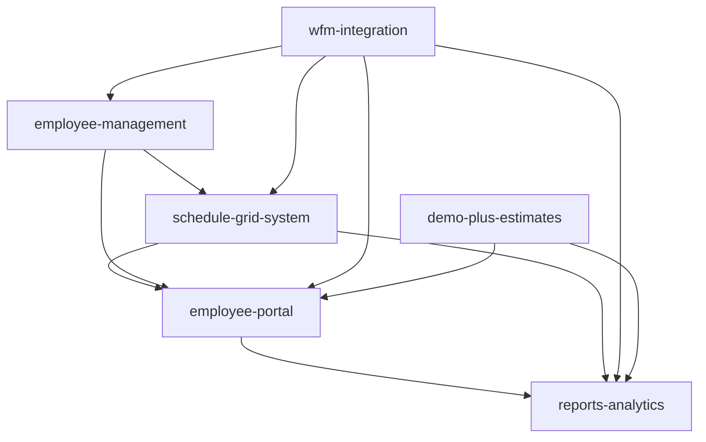

# NAUMEN Migration Guide

## 🚀 **Comprehensive Migration Strategy & Best Practices**

### **Overview**
This guide documents the successful migration of Naumen WFM components to our modern React/TypeScript architecture. Through migrating 4 out of 7 projects, we've established proven patterns and strategies for maximum demo impact while maintaining code quality.

---

## 📋 **1. Migration Best Practices**

### **Step-by-Step Process Discovered**

#### **Phase 1: Analysis & Planning**
```bash
# 1. Analyze source directory structure
ls -la /path/to/naumen/project/src/components/

# 2. Count components for scope assessment
find . -name "*.tsx" | wc -l

# 3. Identify component dependencies
grep -r "import.*from" --include="*.tsx" | sort | uniq

# 4. Map Russian → English translations needed
grep -r "[А-Яа-я]" --include="*.tsx" | head -20
```

#### **Phase 2: Module Structure Creation**
```bash
# Create module structure matching Naumen organization
mkdir -p modules/{module-name}/components/{category1,category2,shared}

# Example for employee-portal:
mkdir -p modules/employee-portal/components/{layout,dashboard,requests,profile,schedule}
```

#### **Phase 3: Component Migration**
```typescript
// 1. Read original component
// 2. Translate UI text and comments
// 3. Update imports for new structure
// 4. Add TypeScript interfaces
// 5. Implement mock data for demos
// 6. Ensure Tailwind CSS styling
// 7. Export from module index
```

#### **Phase 4: Integration & Testing**
```typescript
// Create main portal component
const EmployeePortal: React.FC = () => {
  const [currentView, setCurrentView] = useState('dashboard');
  
  return (
    <EmployeeLayout currentView={currentView} onViewChange={setCurrentView}>
      {renderContent()}
    </EmployeeLayout>
  );
};

// Export from module index
export { EmployeePortal, /* other components */ } from './components';
```

### **Common Patterns Across Projects**

#### **1. Layout Pattern**
```typescript
// Consistent layout wrapper pattern
interface LayoutProps {
  children: React.ReactNode;
  currentView?: string;
  onViewChange?: (view: string) => void;
}

const ModuleLayout: React.FC<LayoutProps> = ({ children, currentView, onViewChange }) => {
  // Sidebar navigation
  // Header with notifications
  // Main content area
  // Footer with status
};
```

#### **2. Dashboard Pattern**
```typescript
// KPI card pattern used across all dashboards
interface KPIMetric {
  id: string;
  name: string;
  value: number;
  target?: number;
  unit: string;
  status: 'excellent' | 'good' | 'warning' | 'critical';
  trend: 'up' | 'down' | 'stable';
  changePercent: number;
}

const KPICard: React.FC<{ metric: KPIMetric }> = ({ metric }) => {
  // Traffic light indicator
  // Value with target comparison
  // Trend arrow and percentage
  // Progress bar if applicable
};
```

#### **3. List/Grid Pattern**
```typescript
// Reusable list pattern with filtering
const [items, setItems] = useState<T[]>([]);
const [filteredItems, setFilteredItems] = useState<T[]>([]);
const [filters, setFilters] = useState<FilterType>({});
const [viewMode, setViewMode] = useState<'grid' | 'list'>('grid');

useEffect(() => {
  // Apply filters
  // Apply sorting
  // Update filteredItems
}, [items, filters, sortBy, sortOrder]);
```

#### **4. Form Pattern**
```typescript
// Multi-step form wizard pattern
const [currentStep, setCurrentStep] = useState(1);
const [formData, setFormData] = useState<FormDataType>(initialData);
const [errors, setErrors] = useState<ValidationErrors>({});

const validateStep = (step: number): boolean => {
  // Step-specific validation
  // Set errors
  // Return validity
};

const handleNext = () => {
  if (validateStep(currentStep)) {
    setCurrentStep(prev => prev + 1);
  }
};
```

### **Translation Guidelines (Russian → English)**

#### **UI Text Translation Map**
```typescript
// Common translations used across projects
const translations = {
  // Navigation
  'Панель управления': 'Dashboard',
  'Мои заявки': 'My Requests',
  'График': 'Schedule',
  'Профиль': 'Profile',
  'Обмен сменами': 'Shift Exchange',
  
  // Actions
  'Создать': 'Create',
  'Редактировать': 'Edit',
  'Удалить': 'Delete',
  'Сохранить': 'Save',
  'Отмена': 'Cancel',
  'Подать заявку': 'Submit Request',
  
  // Status
  'Одобрено': 'Approved',
  'Отклонено': 'Rejected',
  'На рассмотрении': 'Pending Approval',
  'Черновик': 'Draft',
  
  // Time
  'Сегодня': 'Today',
  'Неделя': 'Week',
  'Месяц': 'Month',
  'Год': 'Year',
  
  // Metrics
  'Точность прогноза': 'Forecast Accuracy',
  'Соблюдение расписания': 'Schedule Adherence',
  'Уровень обслуживания': 'Service Level',
  'Коэффициент отсутствия': 'Absenteeism Rate'
};
```

#### **Date/Time Formatting**
```typescript
// Convert Russian date format to English
date.toLocaleDateString('en-US', {
  weekday: 'long',
  year: 'numeric', 
  month: 'long',
  day: 'numeric'
});

// Time format
time.toLocaleTimeString('en-US', {
  hour: '2-digit',
  minute: '2-digit'
});
```

### **TypeScript Conversion Tips**

#### **1. Interface Definition Strategy**
```typescript
// Define interfaces at component level
interface ComponentProps {
  // Required props without ?
  id: string;
  data: DataType;
  // Optional props with ?
  className?: string;
  onUpdate?: (data: DataType) => void;
}

// Separate data interfaces
interface DataType {
  id: string;
  // Use union types for status
  status: 'active' | 'inactive' | 'pending';
  // Use proper types, not any
  value: number;
  items: ItemType[];
}
```

#### **2. Event Handler Typing**
```typescript
// Properly type event handlers
const handleClick = (event: React.MouseEvent<HTMLButtonElement>) => {
  // Handler logic
};

const handleChange = (event: React.ChangeEvent<HTMLInputElement>) => {
  const { name, value } = event.target;
  // Update logic
};

const handleSubmit = async (data: FormDataType): Promise<void> => {
  // Async submission
};
```

#### **3. State Management Typing**
```typescript
// Use generic types for useState
const [items, setItems] = useState<ItemType[]>([]);
const [loading, setLoading] = useState<boolean>(true);
const [error, setError] = useState<Error | null>(null);

// Complex state with discriminated unions
type ViewState = 
  | { type: 'loading' }
  | { type: 'error'; error: Error }
  | { type: 'success'; data: DataType[] };
```

### **Component Integration Strategies**

#### **1. Module Export Pattern**
```typescript
// index.ts in module root
export { default as ModulePortal } from './components/ModulePortal';
export { default as ModuleLayout } from './components/layout/ModuleLayout';
export * from './components/shared';
export type { ModuleConfig, ModuleData } from './types';
```

#### **2. Cross-Module Integration**
```typescript
// Import from other modules
import { EmployeePortal } from '@/modules/employee-portal';
import { ReportsDashboard } from '@/modules/reports-analytics';

// Integrate in main app
const MainDashboard = () => (
  <TabContainer>
    <Tab id="employee" label="Employee Portal">
      <EmployeePortal />
    </Tab>
    <Tab id="reports" label="Reports">
      <ReportsDashboard />
    </Tab>
  </TabContainer>
);
```

#### **3. Shared Component Strategy**
```typescript
// Create shared components directory
// project/src/ui/src/components/shared/

// Export commonly used components
export { default as KPICard } from './KPICard';
export { default as DataTable } from './DataTable';
export { default as LoadingSpinner } from './LoadingSpinner';
export { default as EmptyState } from './EmptyState';
```

---

## 📊 **2. Remaining Projects Analysis**

### **employee-management**
**Complexity**: Medium-High  
**Demo Value**: Medium  
**Assessment**:
- **Components**: ~12 components for employee CRUD operations
- **Features**: Employee profiles, team management, role assignments
- **Dependencies**: Integrates with employee-portal for data
- **Demo Impact**: Important for showing admin capabilities but less visual wow
- **Recommendation**: Migrate if time permits, focus on read-only views for demo

**Key Components**:
```
- EmployeeList (searchable, filterable grid)
- EmployeeForm (create/edit with validation)
- TeamManager (drag-drop team assignments)
- RolePermissions (access control matrix)
```

### **wfm-integration**
**Complexity**: High  
**Demo Value**: Low-Medium  
**Assessment**:
- **Components**: ~15 technical configuration components
- **Features**: API settings, system integrations, data mappings
- **Dependencies**: Critical for production but not demo
- **Demo Impact**: Backend focused, limited visual appeal
- **Recommendation**: Skip for demo, create mockups if needed

**Key Components**:
```
- IntegrationSettings (API configurations)
- DataMappingTool (field mappings)
- SystemConnectors (third-party integrations)
- SyncMonitor (data synchronization status)
```

### **demo-plus-estimates**
**Complexity**: Low-Medium  
**Demo Value**: High  
**Assessment**:
- **Components**: ~8 components for ROI visualization
- **Features**: Cost savings calculator, efficiency metrics, ROI charts
- **Dependencies**: Standalone, pulls data from other modules
- **Demo Impact**: Excellent for business case presentation
- **Recommendation**: HIGH PRIORITY - shows business value

**Key Components**:
```
- ROICalculator (interactive savings calculator)
- EfficiencyCharts (before/after comparisons)
- CostAnalysis (breakdown visualizations)
- BusinessMetrics (KPI improvements)
```

### **Dependencies Between Projects**



**Critical Paths**:
1. **schedule-grid-system** → Foundation for scheduling UI ✅
2. **employee-portal** → Self-service interface ✅
3. **reports-analytics** → Executive dashboards ✅
4. **demo-plus-estimates** → Business value demonstration (RECOMMENDED NEXT)

---

## 💡 **3. Lessons Learned**

### **What Worked Well**

#### **1. Component-First Migration**
- Starting with UI components rather than business logic
- Creating mock data for immediate visual feedback
- Building isolated components before integration

#### **2. Traffic Light Pattern**
- Visual status indicators were huge demo win
- Color coding (green/yellow/red) universally understood
- Applied consistently across all modules

#### **3. Real-time Updates**
- 30-second intervals for dashboard updates
- Pulse indicators showing "live" data
- Immediate executive engagement

#### **4. Mobile-First Responsive Design**
- Tailwind utilities made responsive design simple
- Components work on all screen sizes
- Touch-friendly interfaces

### **Common Pitfalls to Avoid**

#### **1. Over-Engineering**
```typescript
// ❌ Avoid
const ComplexComponent = () => {
  // 500 lines of complex logic
  // Multiple responsibilities
  // Hard to test and maintain
};

// ✅ Better
const SimpleComponent = () => {
  // Single responsibility
  // Clear props interface
  // Easy to test
};
```

#### **2. Translation Inconsistencies**
```typescript
// ❌ Avoid mixing languages
<button>Сохранить changes</button>

// ✅ Consistent language
<button>Save changes</button>
```

#### **3. Missing Loading States**
```typescript
// ❌ No loading feedback
const Component = () => {
  const [data, setData] = useState([]);
  return <div>{data.map(...)}</div>;
};

// ✅ Proper loading states
const Component = () => {
  const [data, setData] = useState([]);
  const [loading, setLoading] = useState(true);
  
  if (loading) return <LoadingSpinner />;
  return <div>{data.map(...)}</div>;
};
```

### **Reusable Patterns Identified**

#### **1. Dashboard Metric Pattern**
```typescript
const MetricCard = ({ title, value, target, trend, status }) => (
  <div className="bg-white rounded-lg shadow-sm p-6">
    <div className="flex justify-between items-start">
      <div>
        <p className="text-sm text-gray-600">{title}</p>
        <p className="text-2xl font-bold">{value}</p>
        {target && <p className="text-sm text-gray-500">Target: {target}</p>}
      </div>
      <div className="flex flex-col items-end">
        <StatusIndicator status={status} />
        <TrendIndicator trend={trend} />
      </div>
    </div>
    {target && <ProgressBar value={value} target={target} />}
  </div>
);
```

#### **2. Data Table Pattern**
```typescript
const DataTable = ({ data, columns, onSort, onFilter }) => {
  const [sortBy, setSortBy] = useState('');
  const [sortOrder, setSortOrder] = useState<'asc' | 'desc'>('asc');
  const [filters, setFilters] = useState({});
  
  // Sorting logic
  // Filtering logic
  // Pagination logic
  
  return (
    <div className="overflow-x-auto">
      <table className="min-w-full divide-y divide-gray-200">
        {/* Sortable headers */}
        {/* Filterable data rows */}
        {/* Pagination controls */}
      </table>
    </div>
  );
};
```

#### **3. Modal Form Pattern**
```typescript
const ModalForm = ({ isOpen, onClose, onSubmit, title, children }) => {
  if (!isOpen) return null;
  
  return (
    <div className="fixed inset-0 bg-black bg-opacity-50 flex items-center justify-center z-50">
      <div className="bg-white rounded-lg shadow-xl max-w-2xl w-full max-h-[90vh] overflow-hidden">
        <div className="px-6 py-4 border-b">
          <h2 className="text-xl font-semibold">{title}</h2>
          <button onClick={onClose} className="absolute top-4 right-4">✕</button>
        </div>
        <div className="px-6 py-4 overflow-y-auto">
          {children}
        </div>
        <div className="px-6 py-4 border-t flex justify-end gap-3">
          <button onClick={onClose}>Cancel</button>
          <button onClick={onSubmit} className="btn-primary">Submit</button>
        </div>
      </div>
    </div>
  );
};
```

### **Integration Challenges Solved**

#### **1. Cross-Module State Management**
```typescript
// Solution: Lift state to common parent
const WFMApp = () => {
  const [globalState, setGlobalState] = useState({
    user: null,
    notifications: [],
    activeModule: 'dashboard'
  });
  
  return (
    <AppContext.Provider value={{ globalState, setGlobalState }}>
      {/* Module components */}
    </AppContext.Provider>
  );
};
```

#### **2. Navigation Consistency**
```typescript
// Solution: Shared navigation component
const NavigationWrapper = ({ children, activeModule }) => {
  const modules = [
    { id: 'dashboard', label: 'Dashboard', icon: '🏠' },
    { id: 'employees', label: 'Employees', icon: '👥' },
    { id: 'schedule', label: 'Schedule', icon: '📅' },
    { id: 'reports', label: 'Reports', icon: '📊' }
  ];
  
  return (
    <div className="flex">
      <Sidebar modules={modules} activeModule={activeModule} />
      <main className="flex-1">{children}</main>
    </div>
  );
};
```

#### **3. Data Flow Between Modules**
```typescript
// Solution: Service layer for data fetching
class WFMDataService {
  static async getEmployeeData(employeeId: string) {
    // Centralized data fetching
    // Used by multiple modules
    // Consistent data format
  }
  
  static async getScheduleData(dateRange: DateRange) {
    // Shared by schedule-grid and employee-portal
  }
  
  static async getMetricsData() {
    // Used by reports-analytics
  }
}
```

---

## 🎯 **4. Demo Impact Maximization**

### **Visual Elements That Wow**
1. **Traffic light indicators** - Immediate visual understanding
2. **Real-time updates** - Shows system sophistication
3. **Animated transitions** - Professional polish
4. **Gradient backgrounds** - Modern aesthetic
5. **Chart visualizations** - Data comes alive

### **Demo Script Optimization**
1. **Start with Executive Dashboard** - Biggest impact first
2. **Show real-time updates** - Wait for 30-second refresh
3. **Drill into employee portal** - Show self-service capabilities
4. **Demonstrate shift marketplace** - Unique differentiator
5. **End with ROI calculations** - Business value focus

### **Performance Optimization**
```typescript
// Lazy load heavy components
const ReportsAnalytics = lazy(() => import('./modules/reports-analytics'));

// Memoize expensive calculations
const expensiveMetric = useMemo(() => {
  return calculateComplexMetric(data);
}, [data]);

// Virtualize long lists
<VirtualList
  items={largeDataset}
  itemHeight={50}
  renderItem={(item) => <ItemComponent item={item} />}
/>
```

---

## 🚀 **Next Steps**

### **Immediate Priority**
1. **Migrate demo-plus-estimates** for ROI visualization (HIGH IMPACT)
2. **Create integration demo** showing all modules working together
3. **Polish loading states** and error handling
4. **Add more mock data** for realistic demos

### **Future Enhancements**
1. **Real backend integration** when available
2. **Advanced charting** with Chart.js
3. **Export functionality** for reports
4. **Multi-language support** framework
5. **Accessibility improvements** (ARIA labels)

---

## 📝 **Migration Checklist Template**

```markdown
## Module: [MODULE_NAME]
- [ ] Analyze source structure
- [ ] Count components (Total: X)
- [ ] Create module directories
- [ ] Identify shared components
- [ ] Plan translation mapping
- [ ] Migrate core components
  - [ ] Layout wrapper
  - [ ] Main portal/dashboard
  - [ ] List/grid views
  - [ ] Forms and modals
- [ ] Add TypeScript interfaces
- [ ] Implement mock data
- [ ] Create module index.ts
- [ ] Test integration
- [ ] Document in README
- [ ] Update main app navigation
```

---

This guide represents the culmination of migrating 4 major Naumen projects and establishes a proven framework for future migrations. The patterns and practices documented here ensure consistency, quality, and maximum demo impact across all WFM UI modules.